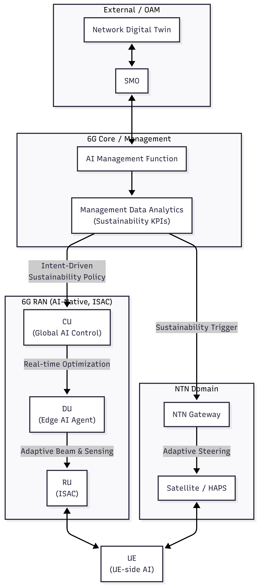
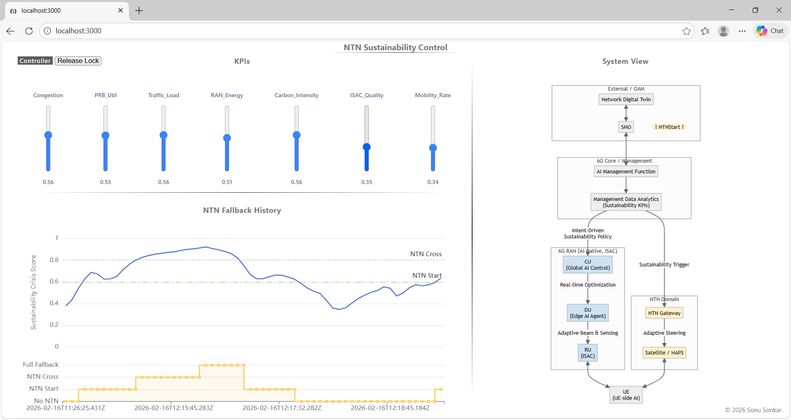

# NTN Sustainability Control

A distributed control-layer prototype exploring a contrarian premise:

> Non-Terrestrial Networks (NTN) in 6G should activate under sustained sustainability stress — and not just for coverage failure, or ubiquitous coverage.

This system reframes NTN as a sustainability-aware control mechanism governed by temporal KPI degradation and deterministic policy.

---

## Thesis

Sustainability degradation in a RAN is not instantaneous. Congestion, PRB pressure, energy draw, carbon intensity, and mobility churn accumulate over time. Reactive threshold triggers are insufficient.

This architecture models sustainability as a temporal signal and governs NTN activation through a deterministic control loop.

- The model predicts risk  
- Policy governs escalation  
- NTN becomes a sustainability valve — not redundancy  

---

## Architecture Overview

    

Design principle: ML predicts sustainability stress. Deterministic policy governs NTN activation.

### Layered Separation

**Inference Layer**
- C++ gRPC service  
- ONNX Runtime (GRU model)  
- Deterministic NTN state machine with hysteresis  

**Control Layer**
- SvelteKit API bridge  
- Explicit controller arbitration  
- Ordered crisis state persistence  

**Persistence**
- Postgres-backed global system state  
- Sequential temporal buffering  

**Infrastructure**
- Docker Compose  
- Dev Container workflow  
- Fully reproducible environment  

Strict separation of concerns:
- Prediction is probabilistic  
- Policy is deterministic  
- NTN activation is explainable  

---

## Web Interface

    

The interface provides:

- Controlled KPI stress simulation  
- Real-time sustainability crisis trajectory  
- NTN fallback state visualization  
- Multi-observer / single-controller governance  

The UI functions as a diagnostic and orchestration lens — not the system itself.

---

## System Overview

### Input KPIs (normalized to [0,1])

- congestion  
- prb_util  
- traffic_load  
- ran_energy  
- carbon_intensity  
- isac_quality  
- mobility_rate  

### Temporal Inference

Temporal input shape: `(1, 60, 8)`

The 8th feature is the prior crisis score, enabling closed-loop temporal feedback.

Output:
- Sustainability crisis score ∈ [0,1]  
- NTN state ∈ {0,1,2,3}  

---

## NTN Governance Model

NTN escalation is governed by:

- NTN_START threshold  
- NTN_CROSS threshold  
- Sustained critical windows  
- Hysteresis-based recovery  

This prevents oscillation and mirrors operator-grade control-plane logic.

NTN acts as:
- A carbon-balancing lever  
- A load redistribution mechanism  
- A resilience stabilizer  
- A sustainability-aware orchestration layer  

---

## Run Locally

1. Create `.env` file: 
    `DB_USER=<user-name>` 
    `DB_NAME=<db-name>` 
    `DB_PASSWORD=<password>`

2. Create `password.txt` file: 
    `<password>` 
    Note: this should be same as is given in the `.env` file.

3. Run pre-built images from docker hub: 
    `docker compose -f docker-compose-prod.yml up -d`

4. Or build from source:

    4.1 Build pre-requisites first: 
    `docker compose build vcpkg-base`

    4.2 Build and start all services: 
    `docker compose up --build -d`

5. Web UI available at: 
`http://localhost:3000`

No host toolchain required.

---

## Research Directions

- Reinforcement learning for adaptive threshold tuning  
- Multi-cell NTN arbitration  
- Carbon-aware traffic steering policies  
- GPU-accelerated inference (TensorRT)  
- Federated edge inference  
- Real traffic trace integration  

---

## Architectural Focus

This project sits at the intersection of:

- Distributed systems  
- Temporal ML inference  
- Deterministic control policy  
- Multi-domain orchestration  
- Sustainability-aware network design  

The objective is not a model demo.

It is an executable control-layer concept for AI-native infrastructure.

## Licensing

This project is licensed under the **MIT License** - see the [LICENSE](LICENSE) file for details.

### Third-Party Software
This project utilizes the following open-source components:
* **[PostgreSQL](https://www.postgresql.org)**: Licensed under the PostgreSQL License (Permissive).
* **[TimescaleDB](https://www.timescale.com)**: Licensed under the Apache License 2.0 / Timescale License.
* **[gRPC](https://github.com)**: Licensed under the Apache License 2.0.
* **[ONNX Runtime](https://github.com)**: Licensed under the MIT License.
* **[vcpkg](https://github.com)**: Licensed under the MIT License.
* **[Svelte](https://github.com)**: Licensed under the MIT License.