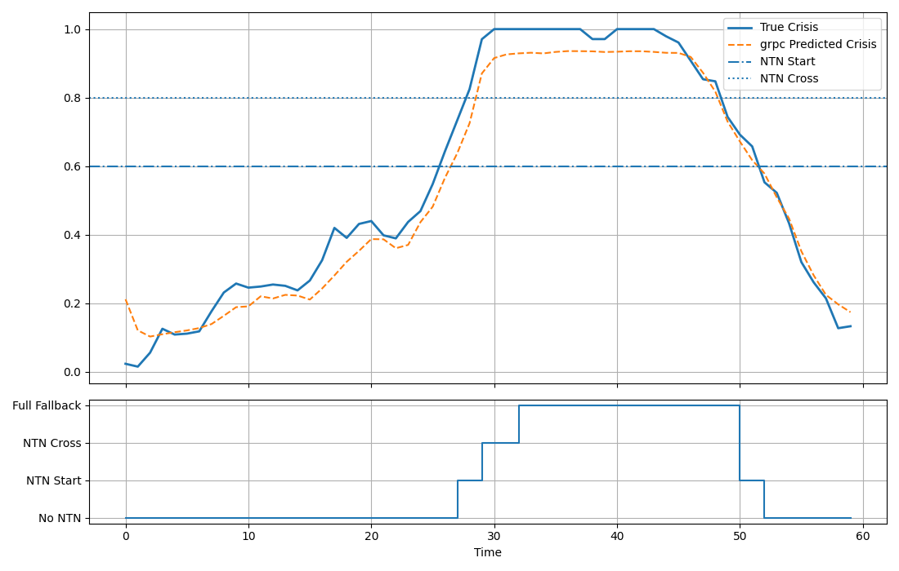

# gRPC Inference Service

This directory contains the C++ gRPC inference service and Python validation scripts for the temporal ONNX (GRU) sustainability model.

The Python scripts allow independent validation of:

- ONNX model inference
- gRPC transport correctness
- End-to-end crisis score behavior

This layer can be tested independently of the web control interface.

---

## Overview

The gRPC service:

- Loads the trained ONNX GRU model
- Accepts a temporal input tensor of shape `(1, 60, 8)`
- Returns sustainability crisis score
- Applies deterministic NTN state transitions

The Python validation script:

- Generates synthetic KPI sequences
- Sends inference requests to the gRPC server (default `localhost:50051`)
- Plots a graph showing original and returned crisis scores 
  (to compare how close the model prediction is)

---

## Prerequisites

- Python
- pip
- Running gRPC service, and listening on port `50051`

Install Python dependencies (from inside the `validation` directory):

`pip install -r requirements.txt`

Create protobuf helper python scripts:

`py -m grpc_tools.protoc -I../proto --python_out=. --grpc_python_out=. crisis.proto`

Two python scripts (crisis_pb2.py, and crisis_pb2_grpc.py) should be there now in the 
`validation` directory.

---

## Starting the gRPC Service

From the project root:

`docker compose -f docker-compose-prod.yml up -d grpc`

---

## Running the Validation Script

From inside the `validation` directory:

`python validate_grpc.py`

Expected behavior:

- A plot will be shown with predictions and true crisis scores, 
  along with NTN state changes at the bottom
- 

---

## Input Format

The inference service expects:

Temporal input shape: `(1, 60, 8)`

Feature ordering:

1. congestion  
2. prb_util  
3. traffic_load  
4. ran_energy  
5. carbon_intensity  
6. isac_quality  
7. mobility_rate  
8. previous crisis_score  

All values must be normalized to `[0,1]`.

---

## Troubleshooting

- Python console would show the returned status and errors.
- Check the gRPC service logs, in the docker container, for any exceptions logged in there.

---

## Purpose

This directory isolates the inference layer for deterministic validation of:

- Temporal model behavior
- Transport correctness
- Crisis score evolution

It enables controlled testing before integration into the distributed control stack.

---

## Licensing

This project is licensed under the **MIT License** - see the [LICENSE](../LICENSE) file for details.

### Third-Party Software
This project utilizes the following open-source components:

#### Core Frameworks & Communication
* **[gRPC](https://github.com)**: Licensed under the Apache License 2.0.
* **[ONNX Runtime](https://github.com)**: Licensed under the MIT License.
* **[vcpkg](https://github.com)**: Licensed under the MIT License.

#### Validation (Python Test Suite)
* **[grpcio](https://grpc.io)**: Licensed under Apache Software License.
* **[grpcio-tools](https://grpc.io)**: Licensed under Apache Software License.
* **[matplotlib](https://matplotlib.org)**: Licensed under Python Software Foundation License.
* **[numpy](https://numpy.org)**: Licensed under BSD-3-Clause AND 0BSD AND MIT AND Zlib AND CC0-1.0.
* **[torch](https://pytorch.org)**: Licensed under BSD-3-Clause.