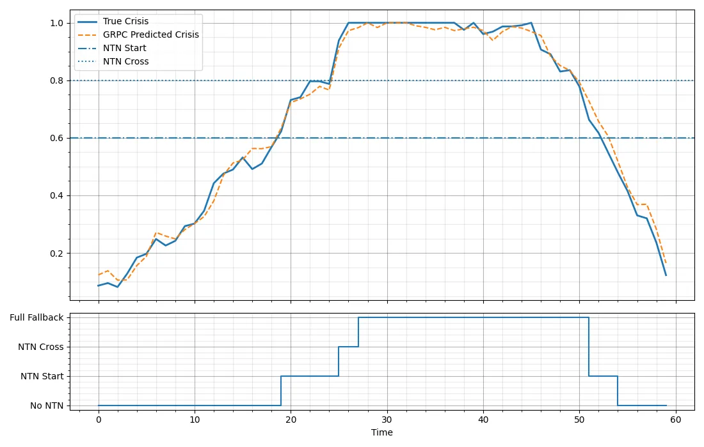

# gRPC Inference Service

This directory contains the C++ gRPC inference service and Python training & validation scripts for the temporal ONNX (GRU) sustainability model.

The Python scripts allow:

- Creation and training of GRU model (for predicting crisis score based on sustainability KPIs)
- Export GRU model to ONNX
- ONNX model parity check
- Model inference and validation (for all, GRU, ONNX and gRPC)
- gRPC transport correctness validation
- End-to-end crisis score behavior

This layer can be tested independently of the web control interface.

---

## Overview

The gRPC service:

- Loads the trained ONNX GRU model
- Accepts a temporal input tensor of shape `(1, 60, 8)`
- Returns sustainability crisis score

The Python scripts:

- Generates synthetic KPI sequences (for both training and validation)
- Creates and trains the GRU model
- Exports the GRU model to ONNX, and does parity check
- Validates GRU and ONNX model
- Sends inference requests to the gRPC server (default `localhost:50051`)
- Plots a graph showing original and returned crisis scores (to compare how close the model prediction is)

---

## Prerequisites

- Python
- pip
- Running gRPC service, and listening on port `50051`

Install Python dependencies (from inside the `ml` directory):

`pip install -r requirements.txt`

Create protobuf helper python scripts (required for grpc validation):

`py -m grpc_tools.protoc -I../proto --python_out=. --grpc_python_out=. crisis.proto`

Two python scripts (crisis_pb2.py, and crisis_pb2_grpc.py) should be there now in the 
`ml` directory.

---

## Model Training & Export (Optional)

Pre-trained GRU model and the exported ONNX model, both are there in the `models` directory.  
But, still, if the GRU model needs to be (re)trained and/or (re)exported to ONNX, here's the sequence.

From inside the `ml` directory:

- `python a_train.py`
- `python b_export_to_onnx.py`
- `python c_onnx_parity_check.py`

Expected behavior:
- Parity check should be passed.
- `models` directory should show the updated timestamps on the model and metadata files. 

---

## Starting the gRPC Service

Run the pre-built images from the docker.

From the project root:

`docker compose -f docker-compose-prod.yml up -d grpc`

OR

Build and run the images from the source.

`docker compose up --build -d`

For more details on exact steps to build and run the services, refer to:

[Run Services section in the main README](../README.md#run-services).

---

## Running the Validation Script

From inside the `ml` directory:

`python validate.py grpc`

To validate the GRU or the ONNX model, just pass `gru`, or `onnx`, instead of `grpc`, in the above command.

Expected behavior:

- A plot will be shown with predictions and true crisis scores, 
  along with NTN state changes at the bottom

    

---

## Input Format

The inference service expects:

Temporal input shape: `(1, 60, 8)`

Feature ordering:

1. congestion  
2. prb_util  
3. traffic_load  
4. ran_energy  
5. carbon_intensity  
6. isac_quality  
7. mobility_rate  
8. previous crisis_score  

All values must be normalized to `[0,1]`.

---

## Troubleshooting

- Python console would show the returned status and errors.
- Check the gRPC service logs, in the docker container, for any exceptions logged in there.

---

## Purpose

This directory isolates the inference layer for deterministic validation of:

- Temporal model behavior
- Transport correctness
- Crisis score evolution

It enables controlled testing before integration into the distributed control stack.

---

## Licensing

This project is licensed under the **MIT License** - see the [LICENSE](../LICENSE) file for details.

### Third-Party Software
This project utilizes the following open-source components:

#### Core Frameworks & Communication
* **[gRPC](https://github.com)**: Licensed under the Apache License 2.0.
* **[ONNX Runtime](https://github.com)**: Licensed under the MIT License.
* **[vcpkg](https://github.com)**: Licensed under the MIT License.

#### Model Training & Validation (Python Suite)
* **[grpcio](https://grpc.io)**: Licensed under Apache Software License.
* **[grpcio-tools](https://grpc.io)**: Licensed under Apache Software License.
* **[matplotlib](https://matplotlib.org)**: Licensed under Python Software Foundation License.
* **[numpy](https://numpy.org)**: Licensed under BSD-3-Clause AND 0BSD AND MIT AND Zlib AND CC0-1.0.
* **[onnx](https://onnx.ai/)**: Licensed under Apache-2.0.
* **[onnxruntime](https://onnxruntime.ai)**: Licensed under MIT License.
* **[onnxscript](https://microsoft.github.io/onnxscript/)**: Licensed under MIT License.
* **[torch](https://pytorch.org)**: Licensed under BSD-3-Clause.